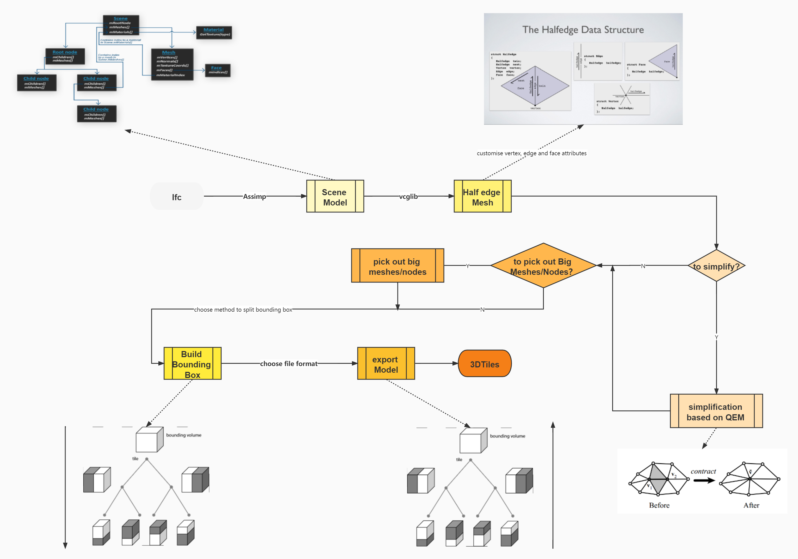

# IfcTo3DTiles模型转换程序说明



=======
**1.**   **程序输入**

- 输入文件格式：程序最开始是针对ifc文件进行设计的，由于中间使用Assimp解析ifc文件，所以只要是Assimp支持导入的3D文件格式，都可以进行拓展，但目前只让ifc文件进入处理流程，防止出现意外的情况

- 支持的几何属性：目前支持的顶点属性包括位置、索引和法向，如果模型不包含法线信息，程序会基于三角面片自动生成

- 其他可选输入参数：每个节点容纳的最大mesh数量；生成层级的最大深度；导出文件为3DTiles文件还是gltf文件；是否打印文件导出过程节点顶点数和mesh数；划分包围盒使用的方法；如果划分包围盒选用HLBVH，可选择使用的线程数量。

**2.**   **数据转换流程**

首先对输入的ifc文件采用Assimp进行解析，生成Assimp模型场景数据，再使用vcglib转成基于半边（half edge）结构的网格数据，并自定义需要的点、边和面的属性，之后可以选择是否对模型进行简化处理和是否单独处理模型中较大的构件和mesh，然后对模型建立包围盒，最后将建立好的包围盒的模型导出为gltf文件或者封装为3DTiles文件。

Assimp模型场景数据是按照节点树组织的，在转换为vcglib的过程中将所有顶点的全局坐标计算出来，之后的处理流程和最终导出的文件不再包含转换矩阵。这一步会将所有复用的网格数据复制单独使用，增加了存储的数据量，减少了渲染时的计算量。

**3.**   **划分包围盒**

目前有以下方法对模型建立包围盒，主要可以分为基于物体的划分和基于空间的划分。基于物体的划分对子节点分别建立包围盒，允许包围盒重叠；基于空间的划分对父节点进行切分，若物体跨越切分点，则物体在相应的子节点都保留。所有的划分方法都从包围盒最长的维度开始，依次尝试划分，除方法一以外，划分的基本单位都是mesh。

**基于物体的方法**

- 基于顶点数量的划分方法，在划分一个模型节点时，尽量使左右节点的顶点数量相等

- 基于中点的划分方法，在划分一个节点时，在选择中点为划分点，若有节点跨越划分点，则制定包含在某一个子节点。

- 基于mesh数量的划分方法，这个方法和基于顶点数量的划分方法思路一样，但是划分的单位粒度更大。

- 基于SAH的方法，在划分一个节点时，沿划分轴正方向不断选择划分点，最终选择可以使左右节点包围盒体积和最小的点作为划分点。在具体实现中采用桶排序先对mesh进行排序，再计算不同划分点得到的包围盒体积。

- 基于HLBVH的方法，这个方法将递归的程序结构改为了循环结构，并将划分过程中的排序采用可并行的排序方法，主要是在程序计算性能上的优化，但是目前程序性能瓶颈主要在Assimp处理阶段，因此需要再优化后和其他方法结合使用。

**基于空间的方法**

- 基于kdTree的方法，采用和SAH相同的方法寻找切分点，但是如果物体跨越切分点，在两边子节点都保留。

以上方法主要来自于三维渲染中“求交”的加速结构，在划分包围盒的过程中，还要考虑一些跨度很长的mesh，这些mesh会使基于物体的方法产生严重的重叠，或者在基于空间的方法中，这些mesh不断出现在两个子节点。因此，在划分包围盒前可以选择是否剔除这些mesh，将其存在一个单独的节点。这样可以提升包围盒的质量，使基于包围盒的几何误差更加精确，但这些单独保存的mesh不会包含在场景包围盒中。

**4.**   **导出数据**

导出数据分为模型数据和节点层级数据，节点层级数据保存为tileset.json文件，记录了当前节点的包围盒数据、几何误差，若为内部节点则记录了子节点数据（children属性），若为叶节点则记录了几何引用信息（content属性）。若选择导出为gltf文件，模型数据分为.gltf和.bin文件；若选择导出3DTiles文件则将.gltf和.bin文件封装为.b3dm文件。此外，还将模型构件的空间关系单独保存为json文件。

数据的导出和包围盒划分的顺序相反，先导出叶节点中包围盒较小的mesh，然后将包围盒较大的mesh交由父节点处理，直到根节点将所有剩下的mesh导出

**5.**   **编译使用**

只支持在windows平台编译使用，需要安装cmake-3.20以上版本，安装visual studio 2019

1. 下载源文件，目前在github上设置为私有库，无法直接下载

   ```bash
   git clone https://github.com/zhaoweihong1998/IFCto3DTiles.git
   ```

2. 进入主目录3DTiles，新建build目录，进入build目录

   ```bash
   mkdir build
   cd build
   ```

3. 命令行执行“cmake ..”

   ```bash
   cmake ..
   ```

4. 命令行执行“cmake –build .”，或者在build目录中打开visual studio工程文件，在visual studio中构建项目

   ```bash
   cmake --build .
   ```

5. 生成的可执行文件在build/bin目录下的文件中IfcTo3DTiles.exe, 使用”“IfcTo3DTiles -h"可以查看相关输入参数

   ```bash
   IfcTo3DTiles -h
   ```

6. IfcTo3DTiles导出的文件在当前目录的output目录下

7. 若要生成库文件可以下载相应分支，按照前述步骤生成库文件，生成的库文件在build/bin目录下

   ````bash
   git clone -b interface https://github.com/zhaoweihong1998/IFCto3DTiles.git
   ````
8. 可以在主目录下直接执行以下命令，完成生成和测试。正常执行会会在JavaInterface/src/output得到导出的文件
   ```bash
   sh Build.sh
   ```
9. docker image生成，需要先安装docker，然后执行如何如下命令进入docker环境，按照之前的步骤编译
   ```
   sudo docker build -t bim .
   sudo docker run -it bim /bin/bash
   ```
**主要增加的功能和修改**

1. 新增模型简化接口，当需要处理的模型数据量很大的时候，可以对模型简化后再处理。现在的简化是针对单个的mesh进行简化，建模精度越高的mesh，简化程度就会越大，根据目前的实验，对模型进行40%的简化后，不会对模型的渲染结果产生太大的影响。
2. 新增大构件单独剔除接口，当发现模型中存在比较大的构件时，直接放到最高层级，不再参与空间树划分，减少大构件对空间树划分的影响，提高划分的准确度。
3. 将原来只沿最长轴划分一次修改为在三个轴依次划分，并选择划分代价最小的划分结果。
4. 将空间树按照mesh组织修改为按照构件组织，防止单个构件的mesh分散在空间树的不同层级，从而构件可以完整渲染，并且便于前端功能的开发。
5. 导出ifc模型的构件组织关系为json文件，并对每一个构件和mesh分配一个全局唯一id，在文件层面提供构件-mesh和构件-模型的查询功能，方便后续的功能开发。
6. 将程序移植到Linux平台，并提供java的调用接口。

